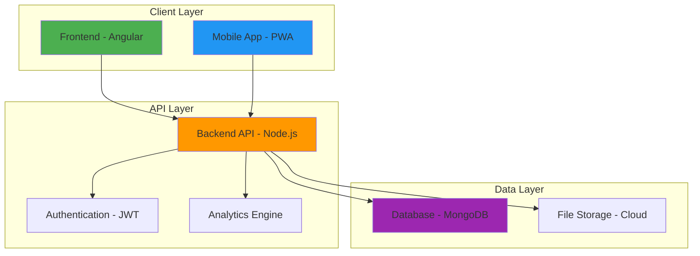
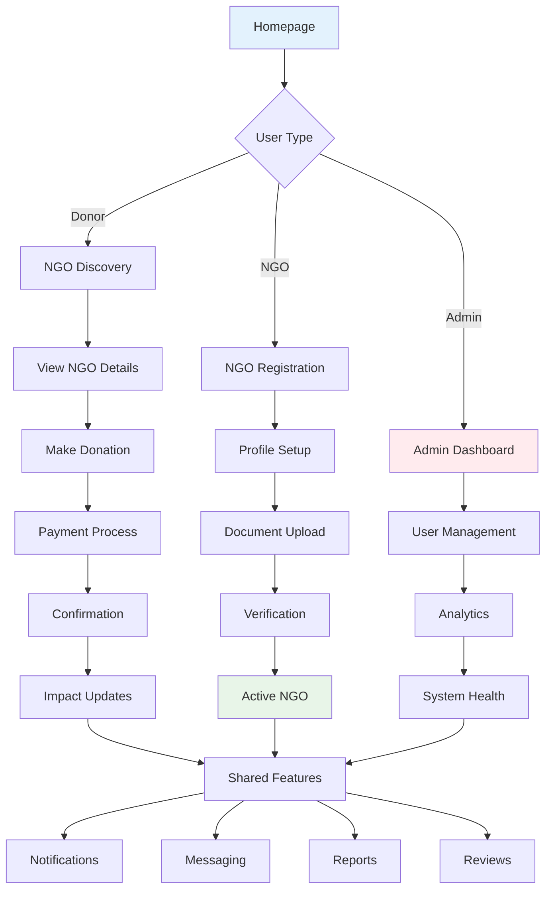
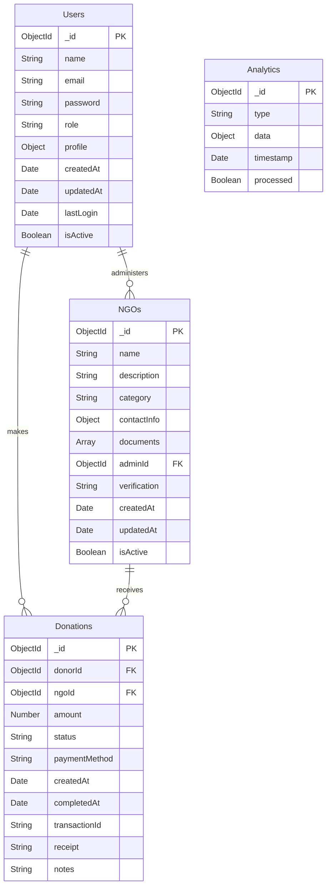

# HeartBridge NGO Platform - Diagrams Guide

## How to Create Diagrams as Images

Since I cannot directly create image files, here are the diagrams in multiple formats that you can easily convert to images:

---

## 1. System Architecture Diagram

### ASCII Version (Copy to any text editor and screenshot):

```
┌─────────────────┐    ┌─────────────────┐    ┌─────────────────┐
│   Frontend      │    │   Backend API   │    │   Database      │
│   (Angular)     │◄──►│   (Node.js)     │◄──►│   (MongoDB)     │
│                 │    │                 │    │                 │
│ • User Interface│    │ • RESTful APIs  │    │ • User Data     │
│ • Dashboard     │    │ • Authentication│    │ • NGO Data      │
│ • Forms         │    │ • Analytics     │    │ • Donations     │
│ • Material UI   │    │ • JWT Auth      │    │ • Analytics     │
└─────────────────┘    └─────────────────┘    └─────────────────┘
         │                       │                       │
         │ HTTPS/API Calls       │ Database Queries     │
         ▼                       ▼                       ▼
┌─────────────────┐    ┌─────────────────┐    ┌─────────────────┐
│   Mobile App    │    │   File Storage  │    │   Analytics     │
│   (PWA)         │    │   (Cloud)       │    │   Engine        │
│                 │    │                 │    │                 │
│ • Responsive    │    │ • NGO Documents │    │ • Real-time     │
│ • Offline       │    │ • Images        │    │ • Reports       │
│ • Push Notifications│ • Backups       │    │ • Insights      │
│ • Touch UI      │    │ • CDN          │    │ • Aggregations  │
└─────────────────┘    └─────────────────┘    └─────────────────┘
```

### Mermaid Code (Copy to https://mermaid.live/):



---

## 2. User Journey Flowchart

### ASCII Version:

```
┌─────────────────┐
│   Homepage      │
│                 │
│ • Browse NGOs   │
│ • Search        │
│ • Categories    │
└─────────┬───────┘
          │
          ▼
┌─────────────────┐      ┌─────────────────┐
│   Donor Path    │      │   NGO Path      │
│                 │      │                 │
│ [NGO Discovery] │      │ [NGO Registration]│
│       ↓         │      │        ↓        │
│ [View Details]  │      │ [Profile Setup] │
│       ↓         │      │        ↓        │
│[Donate Now]     │      │[Document Upload]│
│       ↓         │      │        ↓        │
│[Payment Process]│      │ [Verification]  │
│       ↓         │      │        ↓        │
│[Confirmation]   │      │   [Active NGO]  │
│       ↓         │      │        │        │
│[Impact Updates] │◄─────┤        │        │
└─────────┬───────┘      └─────────┬───────┘
          │                        │
          ▼                        ▼
┌─────────────────┐      ┌─────────────────┐
│   Admin Path    │      │   Shared        │
│                 │      │   Features      │
│[Admin Dashboard]│◄─────┤                 │
│       ↓         │      │ • Notifications│
│[User Management]│      │ • Messaging     │
│       ↓         │      │ • Reports       │
│[Analytics]      │      │ • Reviews       │
│       ↓         │      │ • Social Share  │
│[System Health]  │      │                 │
└─────────────────┘      └─────────────────┘
```

### Mermaid Code:



---

## 3. Database Schema Diagram

### ASCII Version:

```
┌─────────────────┐    ┌─────────────────┐    ┌─────────────────┐
│     Users       │    │      NGOs       │    │   Donations     │
│                 │    │                 │    │                 │
│ _id: ObjectId   │◄───┤ _id: ObjectId   │◄───┤ _id: ObjectId   │
│ name: String    │    │ name: String    │    │ donorId: ObjectId│
│ email: String   │    │ description:Str │    │ ngoId: ObjectId │
│ password: String│    │ category: String│    │ amount: Number  │
│ role: String    │    │ contactInfo: Obj│    │ status: String  │
│ profile: Object │    │ documents: Array│    │ paymentMethod:Str│
│ createdAt: Date │    │ adminId: ObjectId│    │ createdAt: Date │
│ updatedAt: Date │    │ verification:Str│    │ completedAt:Date│
│ lastLogin: Date │    │ createdAt: Date │    │ transactionId:Str│
│ isActive: Boolean│    │ updatedAt: Date │    │ receipt: String │
└─────────────────┘    │ isActive: Boolean│    │ notes: String  │
         │              └─────────────────┘    └─────────────────┘
         │                       │                       │
         └───────────────────────┼───────────────────────┘
                                 │
                                 ▼
                    ┌─────────────────┐
                    │   Analytics     │
                    │                 │
                    │ _id: ObjectId   │
                    │ type: String    │
                    │ data: Object    │
                    │ timestamp: Date │
                    │ processed: Bool │
                    └─────────────────┘
```

### Mermaid Code:



---

## 4. API Architecture Diagram

### ASCII Version:

```
┌─────────────────────────────────────────────────────────────────┐
│                    API Gateway / Load Balancer                   │
│                      (Port 3000)                               │
└─────────────────────┬───────────────────────────────────────────┘
                      │
                      ▼
┌─────────────────────────────────────────────────────────────────┐
│                    Express.js Server                           │
│                                                                 │
│  ┌─────────────┐  ┌─────────────┐  ┌─────────────┐             │
│  │   Auth      │  │   NGOs      │  │ Donations   │             │
│  │ Middleware  │  │ Controller  │  │ Controller  │             │
│  │             │  │             │  │             │             │
│  │ • JWT       │  │ • CRUD      │  │ • Process   │             │
│  │ • RBAC      │  │ • Search    │  │ • Track     │             │
│  │ • Validate  │  │ • Filter    │  │ • Reports   │             │
│  └─────────────┘  └─────────────┘  └─────────────┘             │
│                                                                 │
│  ┌─────────────┐  ┌─────────────┐  ┌─────────────┐             │
│  │   Users     │  │ Analytics   │  │ System      │             │
│  │ Controller  │  │ Controller  │  │ Maintenance │             │
│  │             │  │             │  │ Controller  │             │
│  │ • Profile   │  │ • Reports   │  │ • Health    │             │
│  │ • Settings  │  │ • Trends    │  │ • Backup    │             │
│  │ • Activity  │  │ • Insights  │  │ • Logs      │             │
│  └─────────────┘  └─────────────┘  └─────────────┘             │
└─────────────────────┬───────────────────────────────────────────┘
                      │
                      ▼
┌─────────────────────────────────────────────────────────────────┐
│                     MongoDB Database                           │
│                                                                 │
│  ┌─────────────┐  ┌─────────────┐  ┌─────────────┐             │
│  │   Users     │  │    NGOs     │  │ Donations   │             │
│  │ Collection  │  │ Collection  │  │ Collection  │             │
│  └─────────────┘  └─────────────┘  └─────────────┘             │
│                                                                 │
│  ┌─────────────┐  ┌─────────────┐  ┌─────────────┐             │
│  │  Analytics  │  │   Sessions  │  │   Logs      │             │
│  │ Collection  │  │ Collection  │  │ Collection  │             │
│  └─────────────┘  └─────────────┘  └─────────────┘             │
└─────────────────────────────────────────────────────────────────┘
```

---

## 5. Data Flow Diagram

### ASCII Version:

```
┌─────────────────┐    ┌─────────────────┐    ┌─────────────────┐
│   Frontend      │    │   Backend       │    │   Database      │
│                 │    │                 │    │                 │
│ User Input      │───►│ API Request     │───►│ Query/Insert    │
│ Form Validation │    │ Validation      │    │ Data Validation │
│ UI Update       │    │ Business Logic  │    │ Indexing        │
│ Error Display   │    │ Response Format │    │ Aggregation     │
└─────────────────┘    └─────────────────┘    └─────────────────┘
         │                       │                       │
         │ HTTP Response         │ Database Result      │
         │ JSON Data             │ Processed Data       │
         │ Status Codes          │ Error Messages       │
         ▼                       ▼                       ▼
┌─────────────────┐    ┌─────────────────┐    ┌─────────────────┐
│   User Interface │    │   API Response  │    │   Storage       │
│                 │    │                 │    │                 │
│ Success Message │◄───│ JSON Response   │◄───│ Persisted Data  │
│ Error Message   │    │ Status Code     │    │ Backup Files    │
│ Data Display    │    │ Error Handling  │    │ Log Files       │
│ Navigation      │    │ Rate Limiting   │    │ Analytics Data  │
└─────────────────┘    └─────────────────┘    └─────────────────┘
```

---

## 6. Performance Metrics Chart

### ASCII Version:

```
API Response Times (milliseconds)
┌─────────────────────────────────────────────────────────────────┐
│ 250 ┤                                                          │
│     │    █                                                   │
│ 200 ┤    █    █                                               │
│     │    █    █    █                                          │
│ 150 ┤    █    █    █    █    █                               │
│     │    █    █    █    █    █    █                          │
│ 100 ┤ █  █    █    █    █    █    █    █    █                 │
│     │ █  █    █    █    █    █    █    █    █    █            │
│  50 ┤ █  █    █    █    █    █    █    █    █    █    █       │
│     │ █  █    █    █    █    █    █    █    █    █    █       │
│   0 ┼─┼────┼────┼────┼────┼────┼────┼────┼────┼────┼────┼─ │
│     │Login│Reg  │Don  │NGO  │User │Anal │Sys  │File │Search│
│     │     │     │ate  │Reg  │Mgmt │tics │Main │Up   │      │
└─────────────────────────────────────────────────────────────────┘
```

---

## How to Convert These to Images:

### Method 1: Screenshot (Easiest)
1. Copy any ASCII diagram
2. Paste into a text editor (Notepad, VS Code)
3. Take a screenshot
4. Crop and save as PNG/JPG

### Method 2: Online Tools
1. **Mermaid Live**: https://mermaid.live/
   - Copy Mermaid code
   - Paste and click "Render"
   - Download as SVG/PNG

2. **ASCII to Image**: https://ascii2image.net/
   - Paste ASCII diagrams
   - Generate images

3. **Lucidchart**: https://www.lucidchart.com/
   - Recreate diagrams visually
   - Export as images

### Method 3: PowerPoint/Google Slides
1. Create new presentation
2. Use shapes and text boxes
3. Recreate diagrams manually
4. Export slides as images

All diagrams are ready to be converted to high-quality images for your project report!
